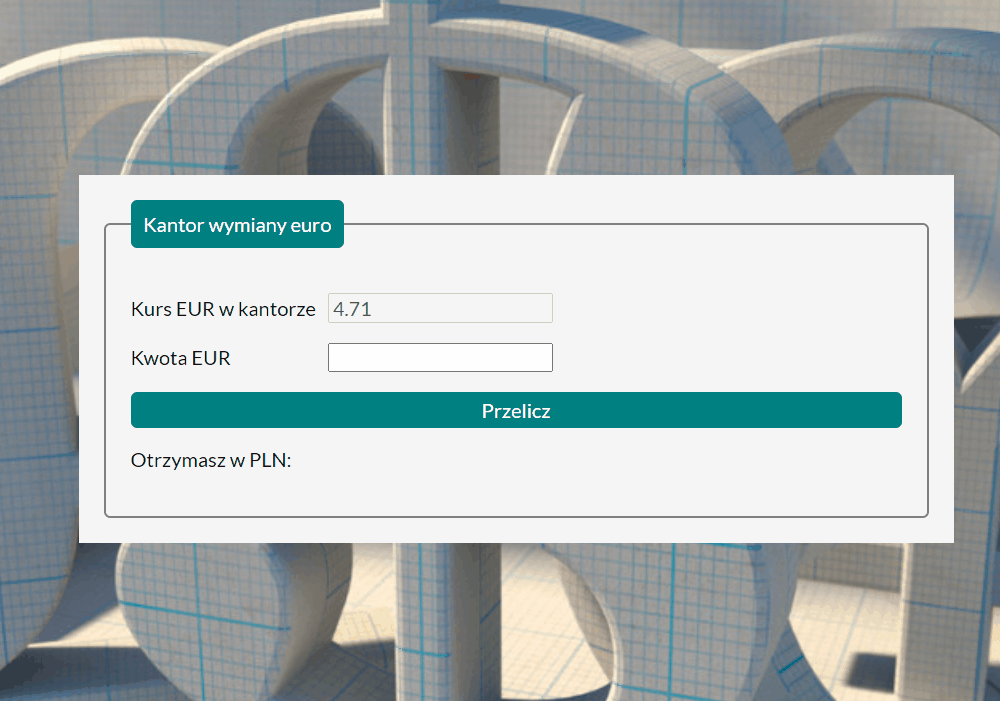

# Currency calculator

## Demo
https://krzysztof0607.github.io/currency-conventer/
## Description
This is a currency calculator for one currency: EURO. Please take a look at demo.
## Technologies
- HTML
- CSS
- JavaScript
- BEM convention
- ES6

1. let and const keywords
2. Arrow Functions
3. Template Literals